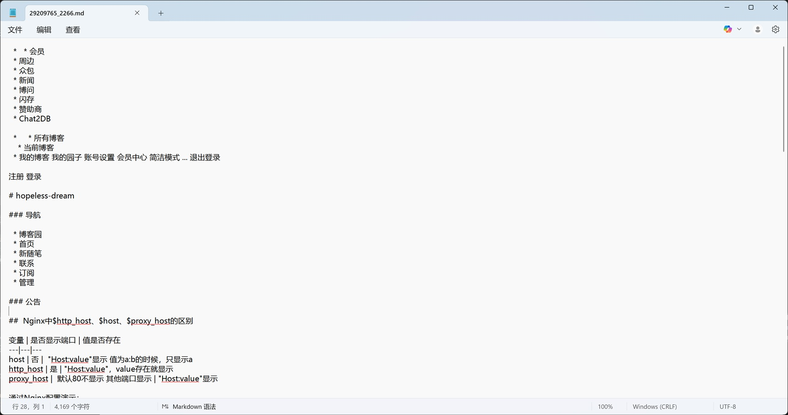

# ThemeStartPredictor
基于 BERT 的自然语言处理模型，用于主题内容起始位置预测模型。

<table border="1">
  <tr>
    <td></td>
    <td></td>
    <td></td>
  </tr>
  <tr>
    <td></td>
    <td></td>
    <td></td>
  </tr>
</table>

### 特性

- 有轻量蒸馏版和完整版模型。
- 无论是哪个版本运行速度都非常快适用于本地运行，比如对于网页爬虫或集成到WebSerach MCP增强结构，去除的无用信息，从而提高模型运行速度。

### 支持的功能

- 从一篇文本中，找出主题起始位置（比如校长或领导超长演讲稿，前面一大段废话）。
- 目前最大支持文本长度512 tokens

### 安装依赖

建议使用 Python 3.11+，先创建虚拟环境，然后安装：

**注意：** 默认的依赖是torch+cuda12.8 可能需要依据实际情况修改, 具体可以参考torch官网

```bash
pip install -r requirements.txt
```

### 模型下载

<table border="1">
  <tr>
    <th>模型名称</th><th>引用代码</th><th>下载</th>
  </tr>
  <tr>
    <td>theme_full</td>
    <td><b>ThemeStartPredictor("google-bert/bert-base-chinese",hidden_size=768)</b></td>
    <td><a href="https://pan.baidu.com/s/1WlwssGR7_Wmzt3ub_pdRcw?pwd=vqjr">下载</a></td>
  </tr>
  <tr>
    <td>theme_min_hz768l2h4_512_distilled</td>
    <td><b>MiniThemeStartPredictor()</b></td>
    <td><a href="https://pan.baidu.com/s/18a0RnlcXlSWGNoiWSkv1GA?pwd=2jja">下载</a></td>
  </tr>
  <tr>
    <td>theme_min_hz128l8h4_1024</td>
    <td><b>MiniThemeStartPredictor(hidden_size=128,num_layers=8,num_heads=4,max_len=1024)</b></td>
    <td><a href="https://pan.baidu.com/s/1aZLafMryLWYpPP8_x2o7ag?pwd=6emv">下载</a></td>
  </tr>
</table>

### 推理使用（`inference.py`）

在使用前，你需要先训练模型权重，或下载预训练的 [模型权重](https://pan.baidu.com/s/13H9UkYQhS7r7kKhP0YB0uA?pwd=6atc)

1. 方式一：输入文本字符串

```bash
python inference.py \
  --model_path weights/theme_start_model.pt \
  --text "大家好，很荣幸我这位校长参加班级的换座位大会。叽里呱啦叽里呱啦。现在，请大家按照指示换位置: 小红：第一排第二列"
```

2. 方式二：读取文件内容进行预测

```bash
python inference.py \
  --model_path weights/theme_start_model.pt \
  --file ./data/test/sample1.md
```

3. 示例输出

```
📍 预测字符起始位置: 54
📎 预测片段:
小红：第一排第二列...
```

### 训练模型（）

本项目包含训练脚本 `train.py` 支持以下参数：

```
--max_batches ：训练总批次数（如：100）
--batch_size：每批样本数量（如：4）
--save_path：保存模型的路径（如：weights/model.pt）
--resume：是否加载已有模型继续训练
```

1. 示例命令：

```bash
python train.py \
  --max_batches 200 \
  --batch_size 4 \
  --save_path weights/theme_start_model.pt
```

2. 继续训练：

```bash
python train.py \
  --max_batches 50 \
  --batch_size 4 \
  --save_path weights/theme_start_model.pt \
  --resume
```

3. 数据格式说明

* 每个 `.md` 文件表示一条训练数据
* 文本中需包含 `<ai-theme>` 和  `</ai-theme>`标签对，表示模型需要学习预测的起始位置和结束位置
* 示例：

```markdown
大家好，今天是个风和日丽的好日子，在此时刻，我想给大家分享一下大模型的部署：
<ai-theme>
## 本地大模型部署指引
#### 目录
1. 准备环境
2. 下载模型
....
</ai-theme>
```

模型训练时会根据该标签自动生成标注索引，推理时无需该标签。
